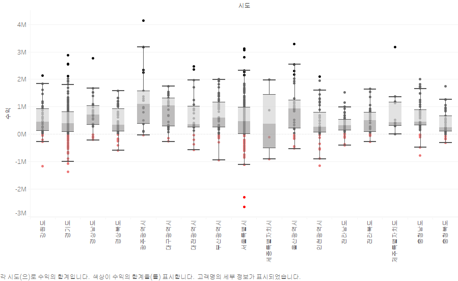
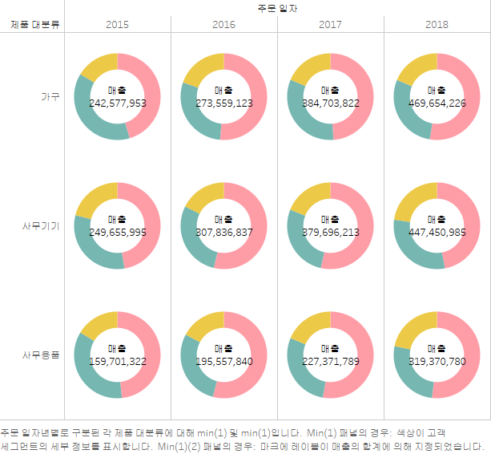

## 1. 고객별 재구매 시기 : 히스토그램
    
- 고객별 두 번째 구매까지 걸린 날짜(구간 단위)와 고객들의 교차 카운트를 나타냄.   
- 각 막대는 특정 구간에 해당하는 고객 수를 보여주며, 높이가 높을수록 그 구간에 해당하는 고객의 재구매 비율이 높은 것을 의미함 
- ex. 그래프에서 100일 구간에 해당하는 막대는 고객들이 두 번째 구매까지 걸린 평균 기간이 100일임을 나타내며, 교차 카운트는 25명   

## 2. 고객 세그멘트별 매출액 : 추이 그래프

## 3. 고객 세그멘트별 매출액 : 누적 막대 그래프

## 4. 분기별 매출액 : 영역 차트

## 5. 월별 매출액 라인 그래프 년도 비교 : 라인, 막대 그래프

## 6. 라운드형 막대 차트

## 7. 평균 기준 차트

- 각 년도 별 평균 이상인 달은 주황색 막대로 표시 됨.   
- 전체 년도 별 평균, 각 년도 별 평균을 확인할 수 있음.       

## 8. 계층 그래프

- 제품 대분류와 중분류별 매출 규모를 나타낸 막대 그래프     

## 9. 지도 그래프(점)

## 10. 지도 그래프(채우기)

- 서울시 5개 권역 설정

## 11. 기호맵 만들기1

## 12. 연도별 수량별 수익

- 연도별 수량(막대)과 수익(라인) 증가 추이

## 13. 지역별 수익 & 고객 세그먼트   
    

## 14. 수도권:기타 비율   
    

## 15. 고객별 매출 순위 그래프   
    

## 16. 박스 그래프   
     

## 17. 파이 차트  
 

## 18. 도넛 차트  
 

## 19. 산포도 그래프와 추세선 
 

## 20. 트리맵

    
    
    

